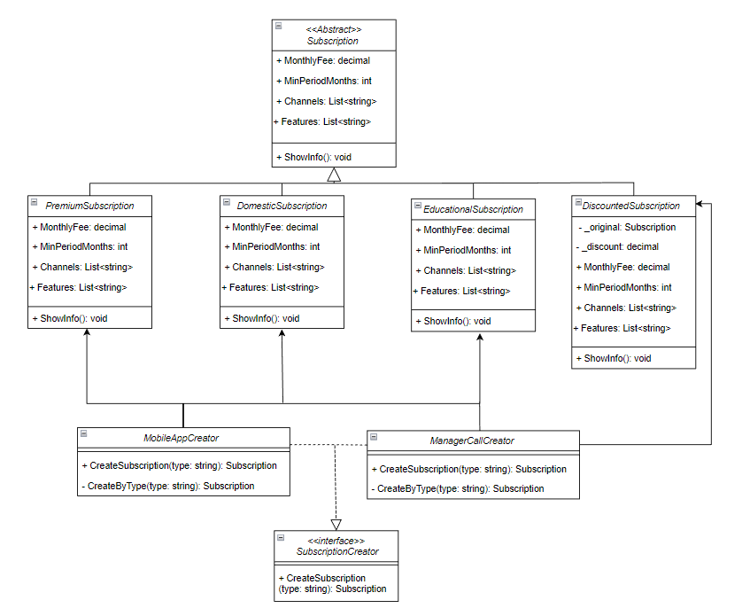
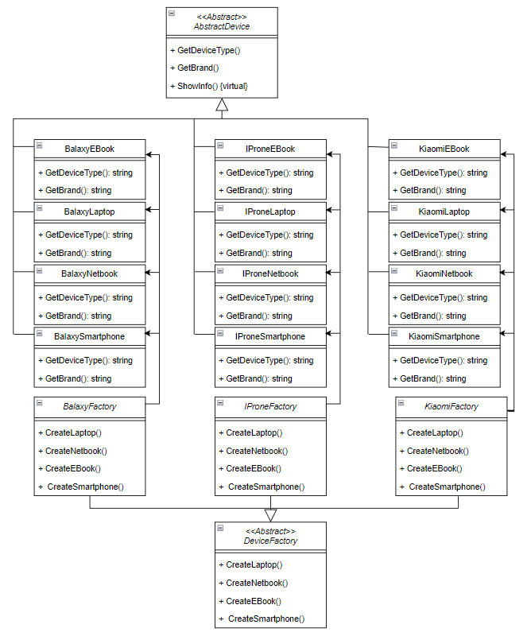
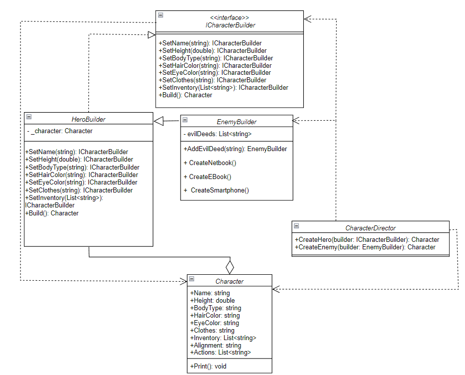

# Lab Work №2 – Creational Design Patterns

## Objective
The goal of this lab is to learn how to implement creational design patterns in C#.

---

## Implemented Tasks

### Task 1: Factory Method
Implemented a system of subscription types for a video provider:
- Types: `DomesticSubscription`, `EducationalSubscription`, `PremiumSubscription`
- Created via: `WebSite`, `MobileApp`, `ManagerCall` classes, each with its own logic
- Verified functionality in the `Main` method

**Class Diagram**  

---

### Task 2: Abstract Factory
Implemented a factory that produces devices for different brands:
- Devices: `Laptop`, `Netbook`, `EBook`, `Smartphone`
- Brands: `IProne`, `Kiaomi`, `Balaxy`
- Demonstrated usage in the `Main` method

**Class Diagram**  

---

### Task 3: Singleton
Created a thread-safe `Authenticator` class ensuring only one instance exists.

---

### Task 4: Prototype
Implemented a `Virus` class with properties:
- Weight, Age, Name, Species, and Children (list of `Virus`)
- Used Prototype pattern to clone entire virus families (with all generations)
- Demonstrated cloning in `Main` method

---

### Task 5: Builder
Created:
- `HeroBuilder` and `EnemyBuilder` that implement a fluent interface
- `CharacterDirector` to construct characters with predefined attributes
- Differentiated alignment and actions for hero and enemy
- Demonstrated object creation in the `Main` method

**Class Diagram**  

---
Creator: Tkachenko Vlad IPZ 23-2
