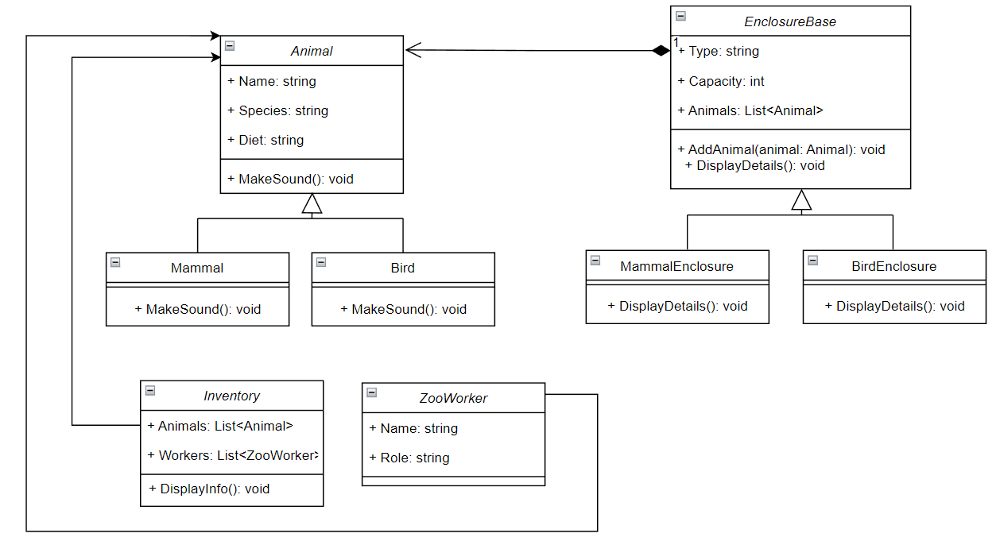

# Zoo Simulation Project

This project is a simple simulation of a zoo using object-oriented programming principles in C#. The structure of the code demonstrates adherence to several fundamental programming principles including SOLID, DRY, KISS, and others.

## Principles Demonstrated:

### 1. **Single Responsibility Principle (SRP)**
Each class in the project has a single responsibility:
- [`Animal`](./Animal.cs#L10-L25): represents animal properties and behavior.
- [`Enclosure`](./Enclosure.cs#L10-L34): manages animal containment.
- [`ZooWorker`](./ZooWorker.cs#L10-L20): stores zoo worker data.
- [`Inventory`](./Inventory.cs#L10-L27): handles listing animals and staff.

### 2. **Open/Closed Principle (OCP)**
Code is open for extension but closed for modification:
- [`Animal`](./Animal.cs#L10) is extended by [`Mammal`](./Mammal.cs#L10) and [`Bird`](./Bird.cs#L10).
- Behavior is overridden via `MakeSound()` method.

### 3. **Liskov Substitution Principle (LSP)**
Derived classes can be used wherever the base class is expected:
- Both `Bird` and `Mammal` can be added to any `EnclosureBase`-based object.
- [`EnclosureBase`](./EnclosureBase.cs) polymorphically holds animals of various subclasses.

### 4. **Interface Segregation Principle (ISP)**
This project demonstrates a lack of unnecessary dependency: classes are not forced to implement interfaces they don’t use. While explicit interfaces are not defined, segregation is respected by meaningful class separation like `Enclosure`, `Inventory`, `ZooWorker`, etc.

### 5. **Dependency Inversion Principle (DIP)**
High-level modules (like `Program.cs`) depend on abstractions (`EnclosureBase`) rather than concrete classes:
- [`Program.cs`](./Program.cs#L15-L17): uses `EnclosureBase` references to store concrete `MammalEnclosure`, `BirdEnclosure`.

### 6. **DRY – Don't Repeat Yourself**
The logic for adding animals to enclosures is centralized in the base class:
- [`EnclosureBase.AddAnimal()`](./EnclosureBase.cs#L18-L27) is reused by both `MammalEnclosure` and `BirdEnclosure`.

### 7. **KISS – Keep It Simple, Stupid**
Code structure is simple, readable, and intuitive:
- Main program logic in [`Program.cs`](./Program.cs) is straightforward and easy to follow.

### 8. **YAGNI – You Aren’t Gonna Need It**
The code avoids adding unnecessary functionality. For instance, `Animal` has only the essential fields and behaviors needed for this simulation.

### 9. **Composition Over Inheritance**
Rather than having `Enclosure` inherit from `Animal`, it contains a list of `Animal` objects:
- [`EnclosureBase.cs`](./EnclosureBase.cs#L13): demonstrates composition by including a `List<Animal>`.

### 10. **Program to Interfaces, not Implementations**
Though interfaces aren't explicitly defined in this simple model, the use of the abstract class `EnclosureBase` enables future interface abstraction:
- [`EnclosureBase`](./EnclosureBase.cs): sets a base for multiple enclosure types.

### 11. **Fail Fast**
`AddAnimal()` method immediately reports when the enclosure is full:
- [`EnclosureBase.cs#L22-L27`](./EnclosureBase.cs#L22-L27): checks capacity before proceeding.

## Сlass diagram:

---

Creator: Tkachenko Vlad IPZ 23-2